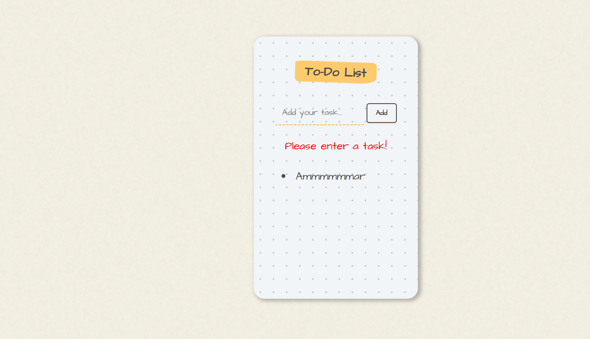
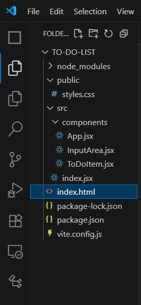
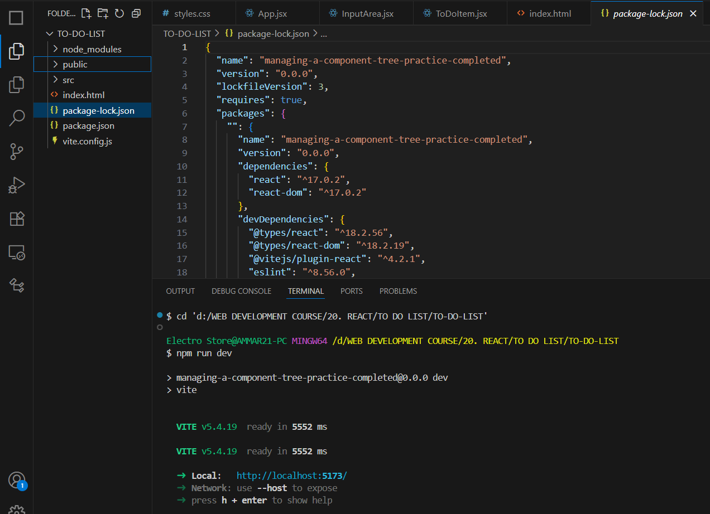

# 📝 To-Do List

This is a minimal React-based To-Do List application that allows users to add and delete tasks easily. 

---

## ⚙️ Tech Stack

- ⚛️ **React.js** (JSX files)
- 💅 **CSS** (styling)
- 🧱 **HTML** (Base structure via **index.html**)
- 🚀 **JavaScript (ES6+)**
- 🔒 **Persistence**: Tasks are saved to browser’s **Local Storage**, so they're not lost on refresh or app termination until **user** deletes it.
- All implemented on **Visual Studio Code.**

---
  
## 💡 Functionality

- Type a task into the input field.
- Click the **Add** button to add it to the list.
- If no text is entered and **Add** is clicked, the message **"Please enter a Task!"** is shown.
- To delete a task, **click directly on the task item**, and it will be removed from the list.
- Styled using a separate CSS file.
 

---

## 🗂️ Project Structure

---

## 🔄 How It Works

1. **index.html** – Base HTML page that includes the root element.
2. **index.jsx** – The entry point that uses **ReactDOM** to render the **<App />** component into the DOM.
3. **App.jsx** – Holds the state for tasks and renders:
   - **<InputArea />** – Handles user input and submission.
   - A dynamic list of **<TodoItem />** – Each item handles its own delete logic via **onClick**.
4. **InputArea.jsx** – A controlled component with:
   - Text input.
   - "Add" button with form validation.
   - Error message if the input is empty.
5. **TodoItem.jsx** – Displays each task and listens for clicks to trigger deletion.
6. **CSS** – Used for styling the layout, input field, buttons, and task list for a clean and user-friendly interface.

---

## 🛠️ Installation

1. Clone the repository or download the files in your navigated folder.
2. Ensure you have a React environment set up (e.g., using Vite or Create React App, etc.).
3. Place the files accordingly follwing the folder structure provided above, then install the required dependencies in **VS Terminal:**
- npm install
- npm install react react-dom
4. After installing dependencies, run the app by entering **npm run dev** in VS Terminal. It will be live on http://localhost:5173/.

  
